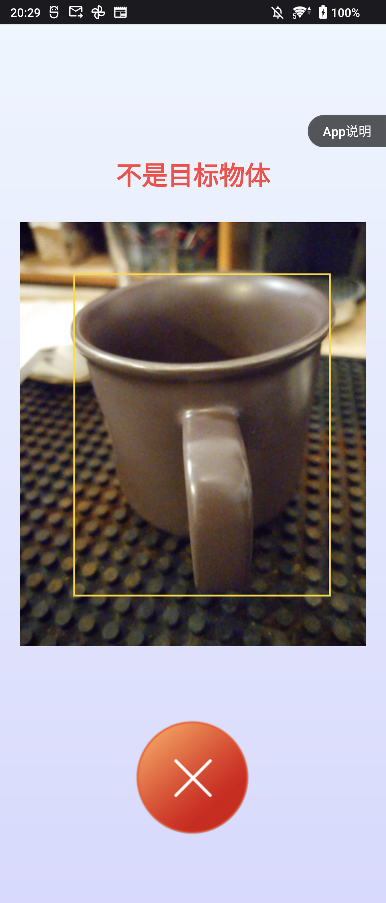

# YOLOv8目标检测Android应用

基于NCNN框架的YOLOv8实时目标检测Android应用。该项目使用ncnn深度学习框架和OpenCV-Mobile进行图像处理，能在Android设备上高效运行YOLOv8目标检测模型。

## 特性

- 使用NCNN框架在Android设备上实时运行YOLOv8目标检测模型
- 利用Android NDK相机实现高效视频流处理
- 支持多类别目标检测和识别
- 优化的移动端性能，适合资源受限设备

## 安装与使用说明

### 步骤1：准备NCNN库
https://github.com/Tencent/ncnn/releases

* 下载ncnn-YYYYMMDD-android-vulkan.zip或自行编译ncnn
* 将ncnn-YYYYMMDD-android-vulkan.zip解压到**app/src/main/jni**目录，并在**app/src/main/jni/CMakeLists.txt**中修改**ncnn_DIR**路径

### 步骤2：准备OpenCV-Mobile库
https://github.com/nihui/opencv-mobile

* 下载opencv-mobile-XYZ-android.zip
* 将opencv-mobile-XYZ-android.zip解压到**app/src/main/jni**目录，并在**app/src/main/jni/CMakeLists.txt**中修改**OpenCV_DIR**路径

### 步骤3：编译与运行
* 使用Android Studio打开此项目，构建并运行！

## 使用说明

应用启动后会自动打开摄像头并开始检测。检测结果会以边界框和类别标签的形式显示在屏幕上。

## 项目说明

* 使用Android NDK相机以获得最佳效率
* 在较旧设备上可能因缺少HAL3相机接口而崩溃
* 所有模型均经过手动修改以接受动态输入尺寸
* 大多数小型模型在GPU上的运行速度比在CPU上慢，这是常见现象
* 在暗光环境中，由于相机曝光时间较长，FPS可能会降低

## 效果展示

## 依赖项

- [NCNN](https://github.com/Tencent/ncnn) - 腾讯开源的高性能神经网络推理框架
- [OpenCV-Mobile](https://github.com/nihui/opencv-mobile) - 针对移动设备优化的OpenCV版本
- [YOLOv8模型](https://github.com/ultralytics/assets/releases/tag/v0.0.0) - Ultralytics提供的YOLOv8预训练模型

## 致谢

本项目基于以下开源项目：
- [ncnn-android-nanodet](https://github.com/nihui/ncnn-android-nanodet)
- [NCNN](https://github.com/Tencent/ncnn)
- [Ultralytics YOLOv8](https://github.com/ultralytics/assets/releases/tag/v0.0.0)

## 许可证

本项目采用Apache License 2.0许可证。